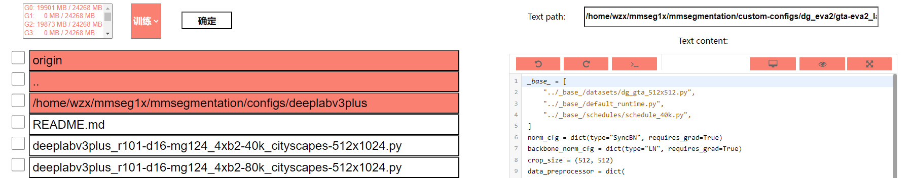
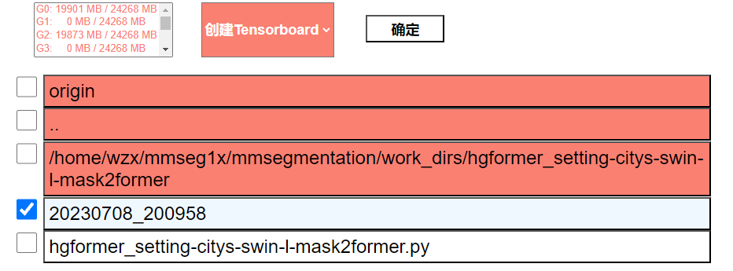
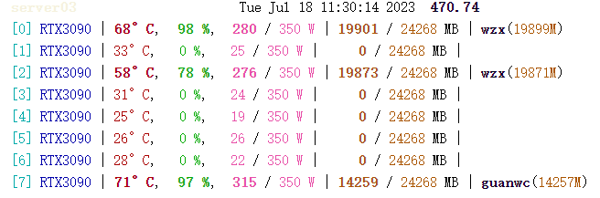
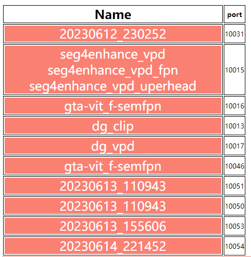
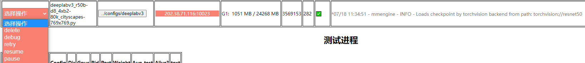

# mmweb
A simple personal tool for visually launching training and testing tasks on the browser side and simply viewing their progress
## Supports:
* Visually select the config file and available Gpus and start training

* View work dirs and Launch Tensorboard

* View GPU occupation

* View all Tensorboards launched

* Pause, Resume, Delete, Test, Debug for all training task

